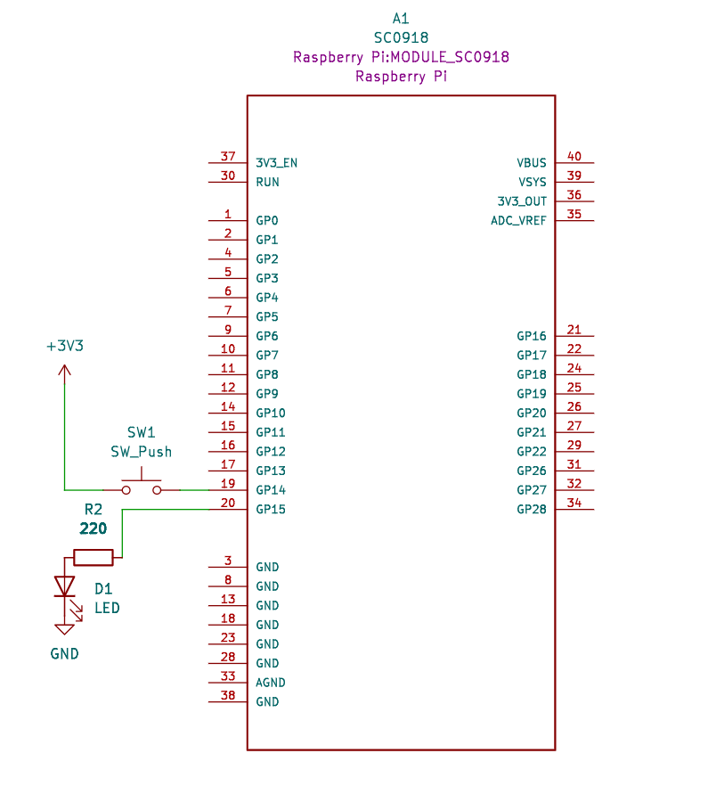

# Button & LED

- button 使用 GPIO14， led 使用 GPIO15 來做測試，線路圖如下：
  

- 此測試程式，每按一次按鈕，LED則會反向一次

  ```python
  from machine import Pin
  import time

  led = Pin(15, Pin.OUT)
  button = Pin(14, Pin.IN, Pin.PULL_DOWN)

  while True:
      if button.value():
        led.toggle()
        time.sleep(0.5)

  ```

- 因為在按按鈕時，會有存在雜訊的干擾，也就是彈跳現象，我們用以下方式解決彈跳(debunce)

  ```python
  from machine import Pin
  import time

  red_led = Pin(15,mode=Pin.OUT)
  btn = Pin(14,mode=Pin.PULL_DOWN)
  is_press = False
  led_status = False

  #解決彈跳
  while True:
      if btn.value():
          time.sleep_ms(50)
          if btn.value():
              is_press = True
      elif is_press:
          time.sleep_ms(50)
          if btn.value() == False:
              print('release')
              led_status = not led_status        
              red_led.value(led_status)        
              is_press = False
  ```