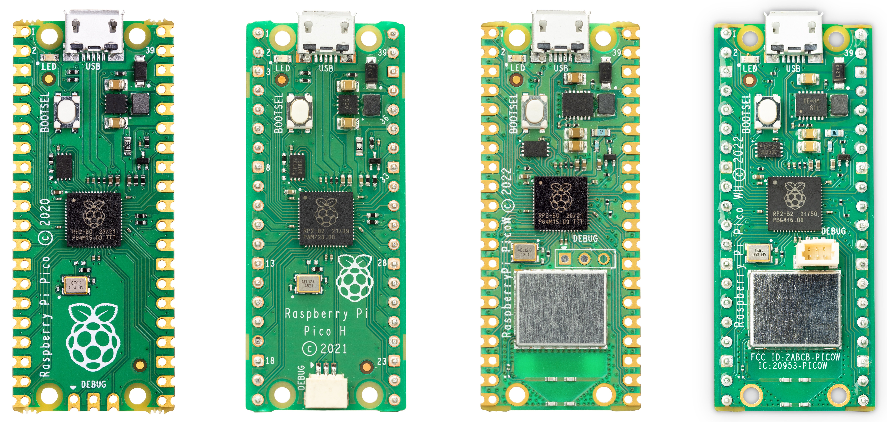
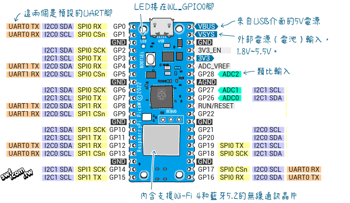
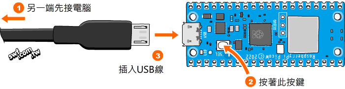
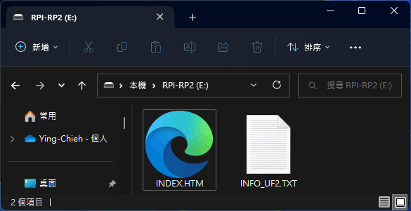
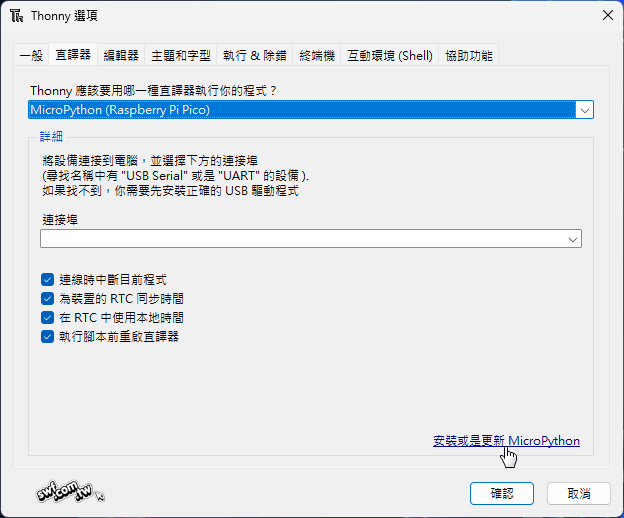
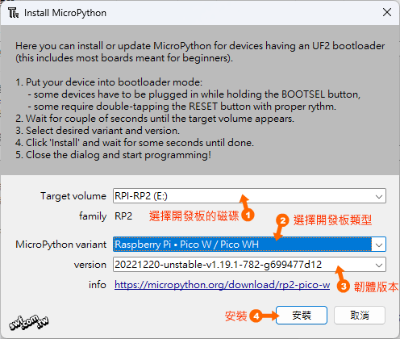
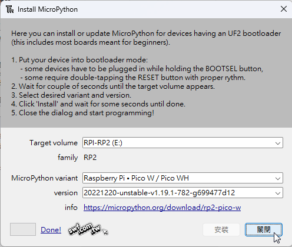
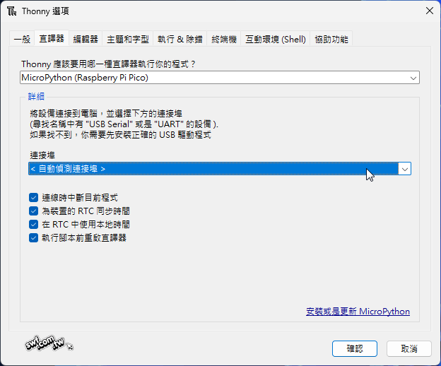

# pico-w

## pico-w 簡介

- [官方文件](https://www.raspberrypi.com/documentation/microcontrollers/raspberry-pi-pico.html)

- [官方教學網站](https://projects.raspberrypi.org/en/projects/getting-started-with-the-pico)

- [pico Examples](https://github.com/raspberrypi/pico-micropython-examples/tree/master)

- [thonny開發軟體下載](https://thonny.org/)

- [Raspberry Pi Pico W的韌體網頁](https://micropython.org/download/RPI_PICO_W/)

- 外觀圖

- Raspberry Pi Pico W開發板（以下簡稱Pico W）是搭載無線通訊晶片的Raspberry Pi Pico開發板，主要規格如下：

1. 工作電壓：1.8 ~ 5.5V
2. 微控器：採用樹莓派基金會研發設計的RP2040，內部是32位元雙核心ARM Cortex-M0+，運作時脈133MHz。
3. SRAM 大小：264KB
4. 快閃記憶體容量：2MB（QSPI介面）
5. Wi-Fi無線通訊功能：2.4GHz 802.11n
6. Bluetooth藍牙通訊功能：暫缺
7. GPIO引腳：26個，包括3個類比輸入腳、16 個PWM通道。
8. 序列通訊介面：2個UART、2個SPI 控制器和2個I2C 控制器。
9. USB介面：內建USB 1.1控制器和PHY，支援主控端（host）和設備端（device）。

- Raspberry Pi Pico W開發板的接腳
Pico W的外觀尺寸和接腳，也跟Pico板一樣，兩側各有20個引腳，採郵票孔設計，方便下游廠商以表面黏著方式把此開發板焊接到產品的主板。

1. VSYS：2 ~ 5V電源輸入腳。
1. VBUS：從micro USB介面取得的5V電源輸出，可供電給需要5V的周邊元件。
1. 3V3：3.3V電源輸出，與Pico W的工作電壓相同。
1. 3V3_EN：開啟或關閉電源；開啟或關閉Pico W以及3V3接腳的電源輸出。
1. RUN/RESET：啟用或停用Pico∕重置，輸入低電位將令Pico W停止運作。
1. GP0-GP28：通用輸出∕輸入腳，板上的LED與GPIO0相連。
1. ADC0 ~ ADC2：具備類比輸入的GPIO腳，可當作類比輸入或者數位輸出∕輸入腳。
1. ADC_VREF：類比數位轉換器（ADC）的參考電壓輸入。
1. AGND：類比數位轉換器的接地腳，與ADC_VREF腳搭配使用。

- Pico W板子上的LED腳位跟Pico板不同，在MicroPython中，Pico W的內建LED接腳就叫做‘LED’或者‘WL_GPIO0’（都是字串型態），例如，底下兩行敘述都代表建立控制LED的物件：
`led = Pin('LED', Pin.OUT)`
或
`led = Pin('WL_GPIO0', Pin.OUT)`

## 使用Thonny IDE自動下載並燒錄MicroPython韌體

- 燒錄Pico W韌體的方式跟Pico板一樣，先按著“BOOTSEL”（啟動選擇）鍵，再將開發板插入電腦USB，然後放開按鍵，電腦會將開發板識別成USB磁碟。

從MicroPython的[Raspberry Pi Pico W的韌體網頁](https://micropython.org/download/RPI_PICO_W/)，下載韌體檔（.uf2格式），再將它拖入Pico W板的「USB磁碟」，它就會自動燒錄韌體並重新啟動。

- 另一個燒錄韌體的辦法是透過Thonny IDE，可省去自行下載韌體的步驟。

1. 同樣是先按著板子的“BOOTSEL”（啟動選擇）鍵，再插入USB線。然後開啟Thonny IDE，選擇主功能表的「執行→設定直譯器」。從底下的面板選擇“Raspberry Pi Pico”類型的直譯器，然後按右下角的“安裝或更新MicroPython”：

1. 按照底下的步驟操作，按下「安裝」，Thonny IDE會自動下載韌體然後燒入Pico W板。

1. 燒錄完成後，按下「關閉」鈕，此時開發板已自動重啟並且改用序列埠通訊方式連上電腦。

1. 按下「確認」，從Thonny IDE的「互動環境（Shell）」可看到已成功連上Pico W開發板。

## 內建硬體

- 計時器：Pico 有自帶計時器(硬體計時器)

  [01_timer.py](../sample_codes/01_timer.py)
- RTC(Real Time Clock)：Pico 有自帶實時時鐘
  - 取得目前日期
  - RTC的時間是取得電腦的時間(當電腦連線時是正常的現在日期和時間)
  - 當單獨運作時(無連接電腦,所以要透過RTC sensor,或wifi取得目前的時間)

  [02_RTC.py](../sample_codes/02_RTC.py)
- WTD(Watch Dog Timer)：重新啟動，倒數計時
  []
