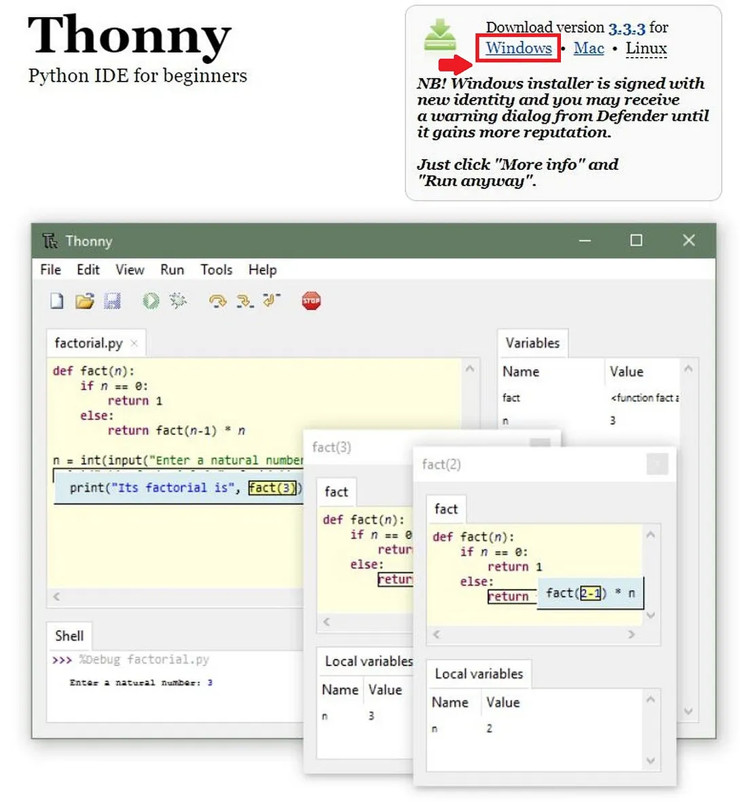
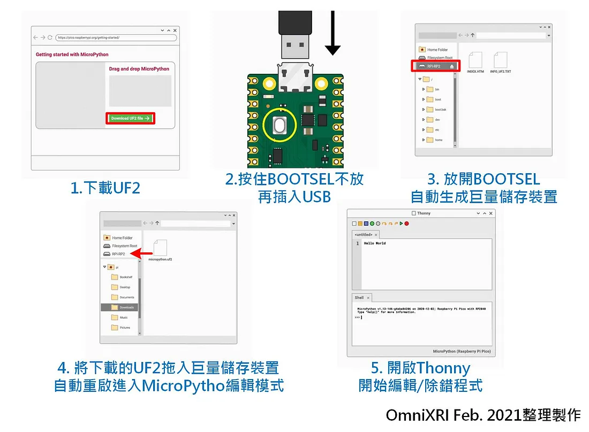

# pico-w

- Raspberry Pi Pico板載26個GPIO腳位、2個SPI、2個I2C、2個UART、3個12位ADC以及16個可控PWM，內建LED是GPIO25，支持配置引腳功能，方便使用者彈性開發與應用。

- [官網文件](https://www.raspberrypi.com/documentation/microcontrollers/raspberry-pi-pico.html)

- 外觀圖

- 腳位圖

- [官方教學網站](https://projects.raspberrypi.org/en/projects/getting-started-with-the-pico)

- [thonny開發軟體下載](https://thonny.org/)

## 開發工具Thonny安裝及MicroPython環境設置

- 下載並安裝 Thonny

- 到 Raspberry Pi 官網，點選 ”Getting started with MicroPython” 頁面，下載UF2檔案。
- 接著按住Pi Pico上BOOTSEL按鍵不放再插入USB供電，插入USB後馬上放開BOOTSEL此，時電腦上就會多出一個巨量儲存裝置（隨身碟）。
- 將剛才下載的*.uf2拖（複製）到新產生的儲存裝置中，Pi Pico就會自動重啟，等待編輯器進行連線編輯。
- 若正確工作則開啟Windows裝置管理員時會看到一個新的虛擬連接埠(COM)，埠號會自動配置。

